Intro
=====

In [Notes on tiddlers stored in a data tiddler][dt], @TW_Tones describes a
proof-of-concept system for storing metadata about certain tiddlers, not in
their fields but in a single JSON tiddler.  The [discussion][dtd] about this
ranged widely, but a very important point was that Tones was attempting to
draw attention to the details of how this was built rather than to its core
features:

[quote="TW_Tones, post:20, topic:14429"]
But the post is less about the solution and more about the details in the code.
[/quote]

I spent some of that discussion in critique of how this presentation was made.
But if I'm going to do this, I need to be willing to put my money where my mouth
is.  So here I go.  I'm going to try to document how I might build a similar
system.  To be clear, I am not trying to precisely duplicate what @TW_Tones did,
but build a version of the same core idea that works the way I would like.

But here too, the process of building and the techniques used are the most
important part of this discussion.  The end product is... fine, but not very
exciting.  I'm not going to do any comparisons of the two outcomes.  The only
differences I know of are that mine handles multiple notes per tiddler, and that
I have a solution of sorts for the rename conundrum he mentions:

[quote="TW_Tones, post:1, topic:14422"]
Warning if the tiddler is renamed you will no longer see the notes for it. Do
have an idea how to fix this?
[/quote]

There was a bit of an answer to the unspoken question of, "well how would you do
this better?"  But that's not quite it, either.  It's not a competition, but a
demonstration of the style of documentation I prefer.  In this case, I'm
documenting the series of steps I might take to build something like this.  I
might later do a second pass that only explains the completed solution.


What We're Building
===================

We store notes for all tiddlers inside a single JSON tiddler. 

We demo this on a copy of https://tiddlywiki.com.  A tiddler with
three notes looks like this when collapsed:

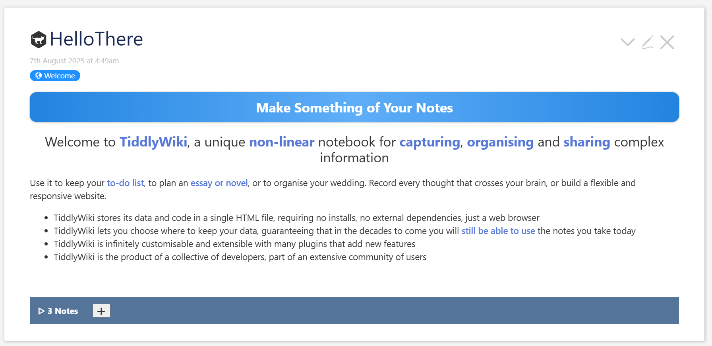

And like this when expanded:

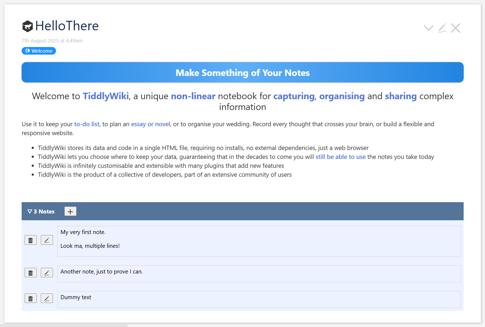

Our content tiddler looks like this:

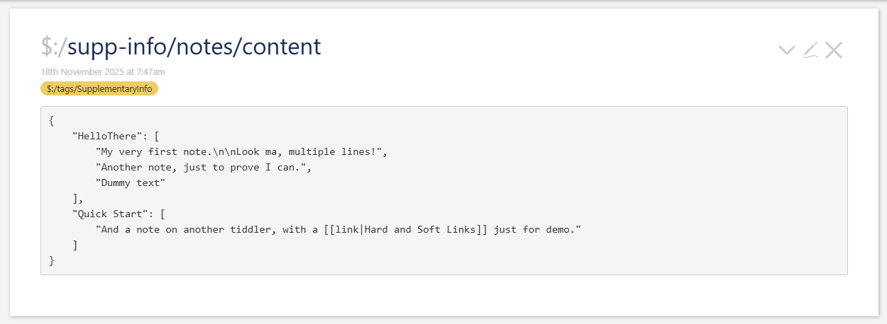

The point here is that this is a *single* JSON tiddler to store notes for *all*
tiddlers.  There are other techniques for doing this sort of external metadata
for tiddlers.  We won't discuss them here.

We also won't discuss here *when* this is a useful technique.  (But if you want
to see a long discussion about the usefulness and limitations of JSON tiddlers,
[#14468][eu] is a recent one.)  The current discussion is all about *how* we
might accomplish this.


Following along
===============

The remainder of this post is a demonstration of the series of steps to build
this.  It includes a few missteps and steps that are little more than
scaffolding for the future.  

To follow along, we start by downloading a copy of [tiddlywiki.com][tw] to our
local machine and open it up.

### Downloading a step ###

Each step is made by combining one or more of the git commits from the building
process.  At each step we have a JSON file that we can download and test out.
It will look like this:

SuppNotes_Step1_.json (9.6 KB)

We download such links, drag the resulting file onto our working wiki, and
choose to `import`.  It's ok to override tiddlers we've downloaded earlier
Twice we will need to save and reload in order to test the changes.  Once or
twice we will need to delete a tiddler or two.  Such exceptions will be noted.

### Viewing step components ###

With each step we will also include links to the commits included in the change.
It should look something like this.

|                                                                         |                                                        |
|:------------------------------------------------------------------------|:-------------------------------------------------------|
| [b7d98f8](https://github.com/CrossEye/TW5-SuppNotesDemo/commit/b7d98f8) | Create contents json                                   |
| [cb27c61](https://github.com/CrossEye/TW5-SuppNotesDemo/commit/cb27c61) | Add almost-blank template                              |
| [e96e421](https://github.com/CrossEye/TW5-SuppNotesDemo/commit/e96e421) | Add count of notes                                     |

> <ins>Aside</ins>
> 
> The links take us to the commits in GitHub.  If you are not used to reading
> these, they are displayed as formatted diff files.  For instance
> [70161e4](https://github.com/CrossEye/TW5-SuppNotesDemo/commit/70161e4) shows
> four files being changed.  The first and third contain just changes to the
> `modified` field.  (This probably means they were accidentally saved, or
> changed and changed back.)  [The fourth][f4] shows a handful of modifications,
> and [the second][f2] looks like this:
> 
> 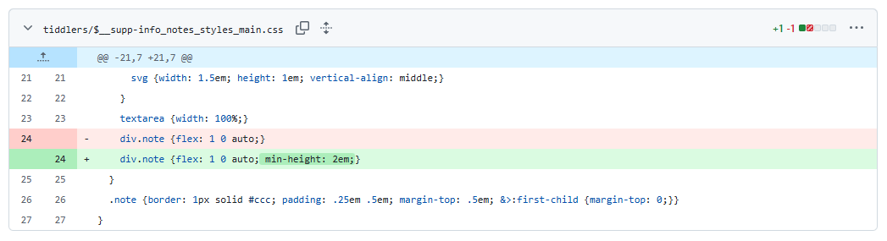
> 
> This show the lines that are ignored, the lines that have changed, and a few
> lines surrounding the changed one.  The lines removed are shown in pale red. 
> Those added are shown in pale green.  And if the lines are similar enough,
> the added or removed parts are shown in darker greens and reds.  


### Debugging ###

It's generally difficult to debug wikitext.  Here, we often end up using
`<$action-log message="Note about what's happening" more="info" goes="here"/>`.
The results of those can be viewed from the developers' tools console
(`CTRL/CMD-SHIFT-J`.)  But we also have a CSS `debug` class to be added to
something we want made prominent -- it is simple a red coloring of the element.
And half-way through we add a sidebar with our relevant material so we don't
have to scroll all around the page to view and edit the various interesting
tiddlers. Most of this debugging information is found in the Git commits in the
middle of the steps.  If we follow along at the commit level, then we should try
to keep the console open to see what's being logged.


### Testing our additional changes ###

If we want to make changes to the code supplied and test the changes we make, we
can export the relevant tiddlers by entering `[prefix[$:/supp-info]]` on the
`Filter` tab of the `$:/AdvancedSearch` page and choosing `export tiddler >
JSON` from the `more` menu.  We just have to ensure that our tiddlers begin with
that prefix. You can then drag the downloaded file atop a fresh copy of the
[main page][tw].


Step 1 - Show footer with note-count
====================================

Changes
-------

### Download ###

We can download this and drag the resulting file to our test wiki:

> [SuppNotes_Step1.json][st1]


### Screenshot ###

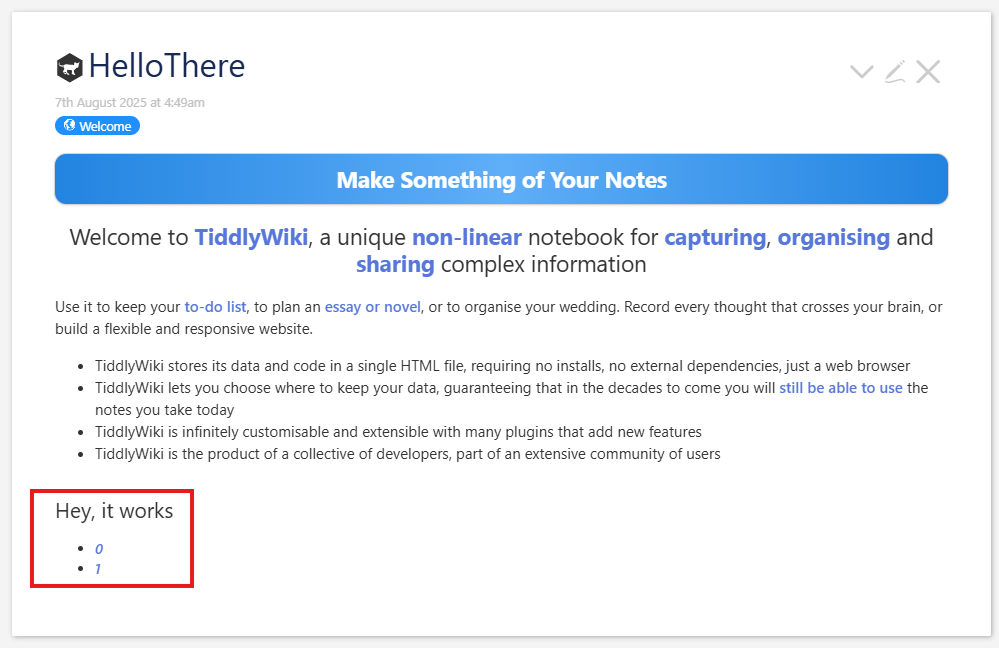


### Commits ###
|                                                                         |                                                        |
|:------------------------------------------------------------------------|:-------------------------------------------------------|
| [b7d98f8](https://github.com/CrossEye/TW5-SuppNotesDemo/commit/b7d98f8) | Create contents json                                   |
| [cb27c61](https://github.com/CrossEye/TW5-SuppNotesDemo/commit/cb27c61) | Add almost-blank template                              |


> ([full diff](https://github.com/CrossEye/TW5-SuppNotesDemo/compare/111aba3..cb27c61))


Explanation
-----------

### JSON Content ###

We start with some JSON to hold our notes.  This JSON string represents an
object, with tiddler titles for keys and arrays of strings for values, each of
which represents a unique note.  It looks like this:

```json
{
  "HelloThere": [
    "My very first note.\n\nLook ma, multiple lines!",
    "Another note, just to prove I can."
  ],
  "Quick Start": [
    "And a note on another tiddler"
  ]
}
```

It is stored in a tiddler titled `$:/supp-info/notes/content` with `type` of
`application/json`, and the tag `$:/tags/SupplementaryInfo`.  We can note
(:smile:!) that it has entries only for the first two tiddlers in the default
view of the [tiddlywiki.com][tw], which should be the basis for our test wikis.

#### Prefix ####

The prefix `$:/supp-info/notes/` is a little speculative.  The thought is that
we might want other supplementary infomation about tiddlers, and they might all
use similar paths and perhaps overlapping implementations.  As we go, we will
see this prefix used for all tiddlers we write, except that two, which seem
likely to be useful to other such supplemental ideas, do not include `"notes/"`.

#### Tag ####

The tag `$:/tags/SupplementaryInfo` is similarly speculative.  This would
identify any any tiddlers holding external supplementary metadata about our
tiddlers.  For now, it's only used here.


### View template ###

We include a [ViewTemplate][vt] (title: `$:/supp-info/notes/view-template`,
tags: `$:/tags/ViewTemplate`), which is run on every tiddler:

```html
<% if [{$:/supp-info/notes/content}jsonget<currentTiddler>] %>

!! Hey, it works

<<list-links "[{$:/supp-info/notes/content}jsonindexes<currentTiddler>]" >>

<% endif %>
```

The content is wrapped up in an `<% if ... %> ... <% endif %>` block, in which
we check if the object represented by our JSON string includes this tiddler's
title as a key.  If not, we do nothing.  But if it is included, we include the
very professional-looking, "Hey, it works" plus a list of links to the *indices*
of the elements in the array of notes for the current title.

The test we use is not the correct one for the final product, but it's often
useful to work this way, making our templates more restrictive at first.  We
only want to scroll among the first three tiddlers to check for multiple notes,
a single note, and no notes.  It will be easy to change later.


#### JSON indices ####

One thing which may catch some TiddlyWiki users unaware is how JSON indices
work.  In most of TW, our indices look like `1, 2, 3, 4, ...`, but when you're
working with JSON, which comes out of JavaScript, the indices look like `0, 1,
2, 3, ...`.  There's a great deal of `[add[1]]`, `[subtract[1]]` involved in
converting between JSON strings and TW indices.  I'm afraid the only real
solution to this is *get used to it!*


#### jsonget Operator ###

The [jsonget Operator][jg] is our first JSON operation.  We will see somewhat
more complex usages later, but here, it just looks like
`[{$:/supp-info/notes/content}jsonget<currentTiddler>]`, where the input is
`{$:/supp-info/notes/content}`, our JSON string representing all notes.  Its
only parameter is the title of the current tiddler.  With this wrapped in an `<%
if %> <%endif %>`, we are simply testing whether the object represented by the
JSON string includes they key of the tiddler under test.  Right now, this will only be true for the titles `"HelloThere"` and `"Quick Start"`.


#### jsonindexes Operator ####

The [jsonindex Operator][ji] is used in other places too, but for a JSON string,
it fetches the string keys of an object (denoted in JSON with `{` - `}` pairs),
or, as here, the numeric keys of an array (denoted in JSON with `[` - `]`
pairs.)  So given the JSON string above, when `currentTiddler` is
`"HelloThere"`, this will find the indices of this array:

```json
  [
    "My very first note.\n\nLook ma, multiple lines!",
    "Another note, just to prove I can."
  ]
```

And these are `0` and `1`.

If we call it with `currentTiddler` set to `"Quick Start"`, we will get the
indices of 

```json
  [
    "And a note on another tiddler"
  ]
```

There is only one here; we will get back `0`, and if you open `Quick Start` the
footer will look like this:

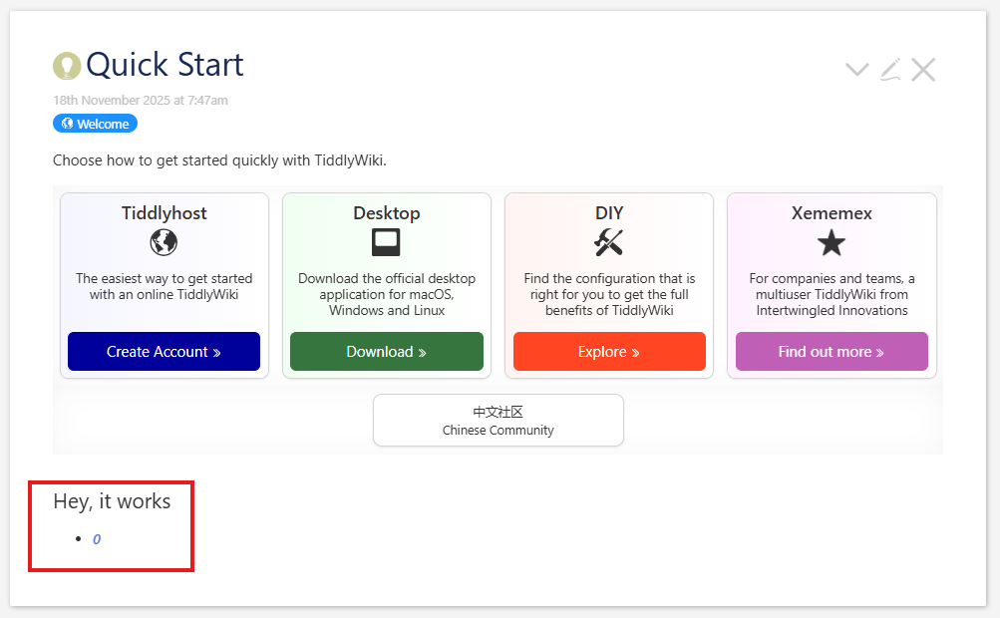


No other tiddlers have their titles in the JSON, so none of them will show any
footer at all.


Step 2 - Styled, expandable section
===================================

Changes
-------

### Download ###

We can download this and drag the resulting file to our test wiki:

> [SuppNotes_Step2.json][st2]

We can simply accept the overlaying of the earlier code.


### Screenshot ###


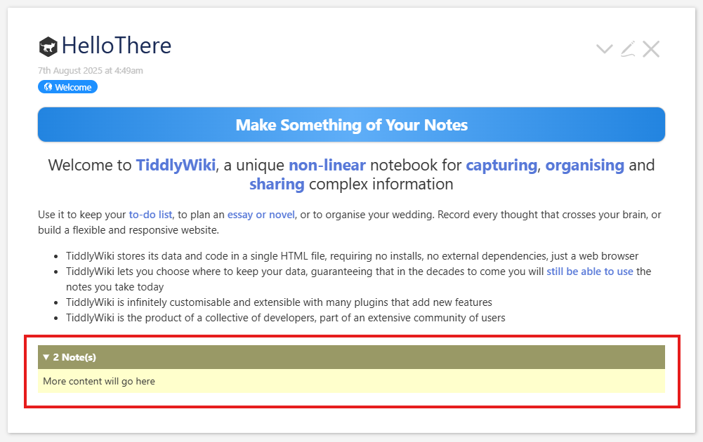

### Commits ###
|                                                                         |                                                        |
|:------------------------------------------------------------------------|:-------------------------------------------------------|
| [e96e421](https://github.com/CrossEye/TW5-SuppNotesDemo/commit/e96e421) | Add count of notes                                     |
| [ecf3be8](https://github.com/CrossEye/TW5-SuppNotesDemo/commit/ecf3be8) | Add details/summary widget                             |
| [e736df9](https://github.com/CrossEye/TW5-SuppNotesDemo/commit/e736df9) | Add a little reasonable, temporary styling             |

> ([full diff](https://github.com/CrossEye/TW5-SuppNotesDemo/compare/cb27c61..e736df9))


Explanation
-----------

### View template ###

We've left the JSON content tiddler alone.  Our template now looks like this:

```html
<% if [{$:/supp-info/notes/content}jsonget<currentTiddler>] %>
<div class="supp-notes">
<$let count={{{ [{$:/supp-info/notes/content}jsonindexes<currentTiddler>last[]add[1]] }}}>

<details>
  <summary><<count>> Note(s)</summary>
   <div class="note-list">More content will go here</div>
</details>

</$let>
</div>

<style>
.supp-notes {
  background-color: #ffc;
  padding: 0;
  summary {background-color: #996; color: white; padding: .5em; font-weight: bold;}
  .note-list {padding: .5em;}
}
</style
<% endif %>
```

Apologies for the poor indentation.  That is straightened out in a future commit.


#### Wrapper `<div>` ####

We add this wrapper

```html
<div class="supp-notes">
  <!-- Content here -->
</div>
```

This is a convenient place to hang our styling.  Adding a unique class like this
makes it much easier to write CSS that doesn't interfere with other parts of our
wikis.  We add one more, `note-list` for similar reasons.


#### `count` variable ####

We calculate a `count` variable using `jsonindexes`, `last[]`, and our first
`add[1]` operation.  (Remember that we've been warned about these, because of a
difference between TW indices and JSON ones.)  This tells us how many notes are
associated with the current tiddler.


#### Using a `details` element ####

We use a [`details` element][ds] to handle hiding and showing content.  We know
that in doing so, we're trading off features, compared to the
[RevealWidget][rw]. The details element does not need any complex state
handling, and is very simple to use.  But it doesn't maintain any state, so if
we close and reopen our tiddler, it will revert to its default behavior: always
open or always closed, depending upon how we've configured it.  For now, simple
wins.  We may need to change this decision before the end, but it will not be
difficult to do so.  (<small><ins>TODO</ins></small>)

We include the count of notes in the [`<summary>`][su] so that it's always
avaible, mostly to make it easier for us to decide if we even need to bother
opening the details.  For a first pass we use "0 Note(s)`, "1 Note(s)", "2
Note(s)", "3 Note(s)", etc., although perhaps later we'll come back and adjust
to "0 Notes", "1 Note", "2 Notes", "3 Notes", etc., which just feels more
polished.  (<small><ins>TODO</ins></small>)

### Adding CSS ###

Above we added classes to several elements in order to make it easy to apply
stylesheets.  Now we add a `<style>` element and create styles.

In this document, we will not discuss how to use CSS.  There are many [wonderful
CSS tutorials][cs] and [MDN][mc] maintains the definitive reference
documentation.  If I personally  need any CSS how-tos, I depend on [CSS
Tricks][ct], but there are many other good sites.  So here, we will only discuss
*what* we do with CSS, not *how* we do it.

But first, we should note one CSS feature that's now [become
ubiquitous][cnu] across all major devices/browsers, [CSS Nesting][cn].  Instead
of writing (in an entirely made-up example -- don't blame me if it hurts your
eyes, ok?)

```css
div.my-class {border: 1px solid red;}
div.my-class p.another-class {background: pink}
div.my-class p.another-class ul {font-size: 125%; font-weight: bold;}
div.my-class p.another-class ul.third-class {font-size: 110%;}
```

with all that repetition, we can now write

```css
div.my-class {
  border: 1px solid red; 
  p.another-class {
    background: pink;
    ul {
      font-size: 125%; font-weight: bold;
      &.third-class {font-size: 110%;}
    }
  }
}
```

We take advantage of this here.  All our rules will be nested in `.supp-notes`,
and parts will be inside `.note-list`.


#### Colors ####

The other styles here are meant to last, but the color scheme is meant mostly to
make the work stand out while we're developing it.  It's easiest if we can see
it at a glance.  At the end, we will probably want to find some useful palette
entries for our colors, if possible.   (<small><ins>TODO</ins></small>)


Step 3 - Display note content
=============================

Changes
-------

### Download ###

We can download this and drag the resulting file to our test wiki:

> [SuppNotes_Step3.json][st3]

We can simply accept the overlaying of the earlier code.


### Screenshot ###

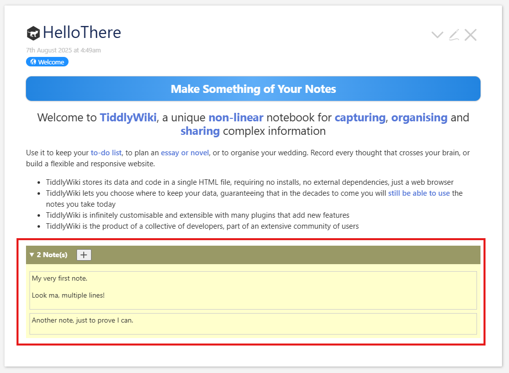

### Commits ###

|                                                                         |                                                        |
|:------------------------------------------------------------------------|:-------------------------------------------------------|
| [bc558d4](https://github.com/CrossEye/TW5-SuppNotesDemo/commit/bc558d4) | Show (partial) content                                 |
| [1dc0711](https://github.com/CrossEye/TW5-SuppNotesDemo/commit/1dc0711) | Show multiple notes                                    |
| [6ada50e](https://github.com/CrossEye/TW5-SuppNotesDemo/commit/6ada50e) | Display notes in block mode, add dummy new control     |

> ([full diff](https://github.com/CrossEye/TW5-SuppNotesDemo/compare/e736df9..6ada50e))


Explanation
-----------

### JSON Content ###

In our JSON content, the one Note for "Quick Start", has expanded slightly to include a wikitext link.  We'll see why below.


### View Template ###

Our template now looks like this (less the CSS):

```html
\procedure add-note()
<$action-log clicked=<<now>> />
\end add-note

<% if [{$:/supp-info/notes/content}jsonget<currentTiddler>] %>
<div class="supp-notes">
<$let count={{{ [{$:/supp-info/notes/content}jsonindexes<currentTiddler>last[]add[1]] }}}>

<details open>
  <summary>
    <<count>> Note(s)  
    <span class="controls">
      <$button actions=<<add-note>> ><span class="icon">{{$:/core/images/new-button}}</span></$button>
    </span>
  </summary>
  <div class="note-list">
      <$list filter="[{$:/supp-info/notes/content}jsonindexes<currentTiddler>]" variable="index">
        <div class="note">
          <$wikify name="note" text={{{ [{$:/supp-info/notes/content}jsonget<currentTiddler>,<index>] }}} output="html"><<note>></$wikify>
        </div>
      </$list>
  </div>
</details>

</$let>
</div>

<style> /* ... */ </style>
<% endif %>
```

#### `details` element ####

Note that we've now made the `<details>` widget default to `open`.  This is a
useful debugging technique, so that our changes are immediately visible.  We
will revert this by the end. <small>(<ins>TODO</ins>)</small>


#### new `<$button>` widget ####

We create a [button][bw] to add a note to the current tiddler, and place it on
the header row, so it's available whether or not the `details` are expanded.  It
is connected to this new [procedure][pr]:


```text
\procedure add-note()
<$action-log clicked=<<now>> />
\end add-note
```

All this does for now is to log to the developer console (usually avaiable on
desktop/laptop via `CTRL/CMD-SHIFT-J`).  If we open the console and click the
button, we should see a new object logged to the console, with a `clicked`
property set to the current time.  If we click it multiple times, we should see multiple logging events.

Doing dummy version of buttons like this lets us first test if the button
displays properly and calls our action when it is is clicked, without focusing
on the logic of what the button is supposed to do.


#### Displaying notes ####

Displaying and modifying Notes is the core of our project.  Here for the first
time, we actually show them.

```html
      <$list filter="[{$:/supp-info/notes/content}jsonindexes<currentTiddler>]" variable="index">
        <div class="note">
          <$wikify name="note" text={{{ [{$:/supp-info/notes/content}jsonget<currentTiddler>,<index>] }}} output="html"><<note>></$wikify>
        </div>
      </$list>
```

We use a [`<$List>` widget][lw] to iterated the indices, and a new usage of
[`jsonget`][jg] we haven't seen so far:
`[{$:/supp-info/notes/content}jsonget<currentTiddler>,<index>]`.  Here we have
two parameters, `<currentTiddler>` and `<index>`.  The current tiddler is the
title we're working with, and the index is the variable from our iteration.  So,
for instance, if the current tiddler is `"HelloThere"`, and the index is `1`,
then, remembering that JSON array indices start from `0`, from our JSON of 

```json
{
  "HelloThere": [
    "My very first note.\n\nLook ma, multiple lines!",
    "Another note, just to prove I can."
  ],
  "Quick Start": [
    "And a note on another tiddler, with a [[link|Hard and Soft Links]] just for demo."
  ]
}
```

we can see that this should result in the string, `"Another note, just to prove
I can."`


#### `wikify Widget` ####

To display this note, we use the [`WikifyWidget`][ww], which takes the text we
just found, and, treating it as wikitext, converts it into a format useful for
displaying (we use the `output` parameter to choose the format `"html"`),
storing the results in the variable `note`.  Then in the content of the widget,
we include the reference `<<note>>` to put that out to the user.  That this is
now treating the content as wikitext explains the reason we've updated `Quick
Start/0`: we want to test some actual wikitext and not just plain test.
Theoretically, seeing that blank lines are respected would be enough, but
something like links feels like a more substantial test.


The results of this are wrapped in a `<div class="note">` to have someplace to
hang our styling.  Note the blue link in the following:

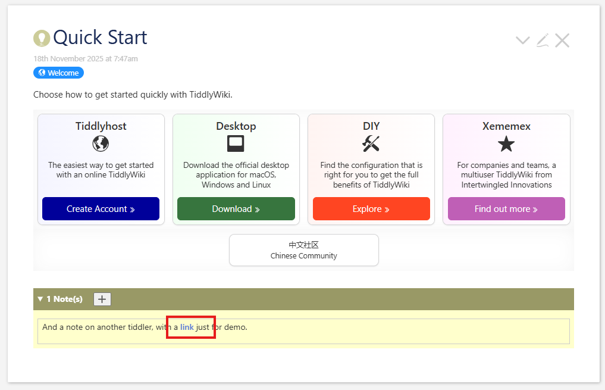


### Styles ###

We won't discuss these any further, but the [CSS changes][chg3] are online.


Step 4 - Make `add` button functional
=====================================

Changes
-------

### Download ###

We can download this and drag the resulting file to our test wiki:

> [SuppNotes_Step4.json][st4]

You can simply accept the overlaying of the earlier code.


### Screenshot ###


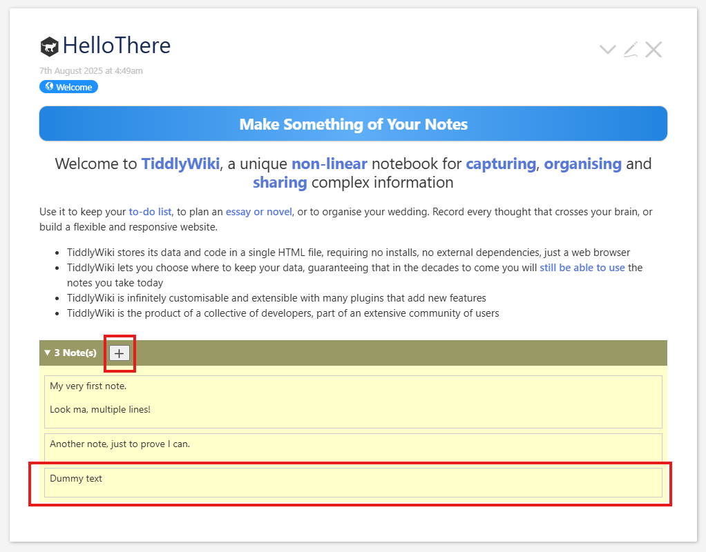


### Commits ###

Only one this time:

|                                                                         |                                                        |
|:------------------------------------------------------------------------|:-------------------------------------------------------|
| [657db41](https://github.com/CrossEye/TW5-SuppNotesDemo/commit/657db41) | Make button actually add dummy text to content tiddler |

> ([full diff](https://github.com/CrossEye/TW5-SuppNotesDemo/compare/6ada50e..657db41))

Explanation
-----------

### View Template ###

The only change here is to make our Add Note button function properly.

```html
\procedure add-note()
<$let count={{{ [{$:/supp-info/notes/content}jsonindexes<currentTiddler>last[]add[1]] }}}>
<$action-setfield 
  $tiddler="$:/supp-info/notes/content"
  $file="text"
  $value={{{ [{$:/supp-info/notes/content}jsonset<currentTiddler>,<count>,[Dummy text]format:json[2]] }}} 
/>
</$let>
\end add-note
```

The very important thing we need to notice here is that we first create a new
JSON string from our old one, using the [`jsonset Operator`][js], then we update
the JSON string in our content tiddler by overwriting the whole thing with this
new string.  There is no shortcut to change just the relevant part of JSON
strings.  The [discussion][dtd] mentioned in our opening section explains this
in much more detail.

We fill the new tiddler's `text` field with "Dummy text", just so that we can
see this working.  Editing will come pretty soon.


Step 5 - Adding controls for individual Notes
=============================================

Changes
-------

### Download ###

We can download this and drag the resulting file to our test wiki:

> [SuppNotes_Step5.json][st5]

We can simply accept the overlaying of the earlier code.  ***But there is a new
tiddler included**, and that one is a JS module, so we will need to save and
reload our sample wiki to see these changes.*


### Screenshots ###


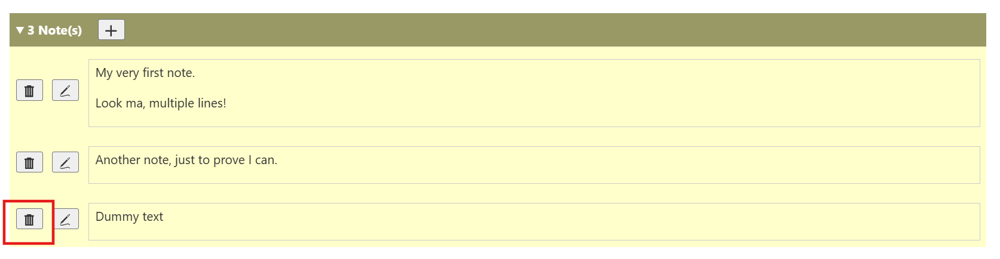

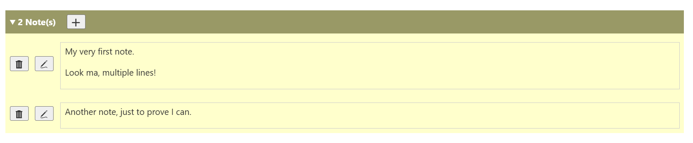

### Commits ###

|                                                                         |                                                        |
|:------------------------------------------------------------------------|:-------------------------------------------------------|
| [1a 7eba2](https://github.com/CrossEye/TW5-SuppNotesDemo/commit/1a7eba2) | Add dummy buttons for delete and edit                  |
| [8d8247b](https://github.com/CrossEye/TW5-SuppNotesDemo/commit/8d8247b) | Make delete button work                                |
| [445a0ea](https://github.com/CrossEye/TW5-SuppNotesDemo/commit/445a0ea) | Move the buttons up a level for better formatting      |

> ([full diff](https://github.com/CrossEye/TW5-SuppNotesDemo/compare/657db41..445a0ea))


Explanation
-----------

### JSON Content ##

Once again, there is nothing surprising in the JSON.  We do keep the Dummy Text note we added last time to `"HelloThere"`, but other than that, nothing has changed.


### Custom JavaScript `jsondelete` operator ###

There is a new tiddler this time, a custom operator to delete a node in a JSON string.  A different version of this operator is [scheduled to be included][jd] in `5.4.0`, but for now we're using a [custom version][jds], one which should act much the same but which is simpler to include here.

**Note well**: We do *not* need to understand how this works under the hood to follow along here.  Those who are not interested in the JavaScript nuts and bolts can feel free to skip this session.  We won't judge.  And we'll catch up to you in the `View Template` section.

#### Code ####

```js
exports["jsondelete"] = function(source,operator,options) {
	var results = [];
	source(function(tiddler,title) {
		var data = $tw.utils.parseJSONSafe(title,title);
		if(data) {
			const res = deepDelete(operator.operands)(data);
			results.push(JSON.stringify(res));
		}
	});
	return results;
};

const deepDelete = ([first, ...rest] = []) => (obj, 
	p = Number(first), 
	a = p >= 0 ? p : Array.isArray(obj) && Math.max(0, obj.length + p), 
) => 
	first == undefined 
		? obj
		: Array.isArray(obj)
			? rest.length == 0
				? [...obj.slice(0, a), ...obj.slice(a + 1)]
				: [...obj.slice(0, a), deepDelete(rest)(obj[a]), ...obj.slice(a + 1)]
			: rest.length == 0
				? Object.fromEntries (Object.entries(obj).filter(([k, v]) => k !== first))
				: Object.fromEntries(Object.entries(obj).map(
					([k, v]) => (k == first) ? [k, deepDelete(rest)(v)] : [k, v]
		  		))
```

#### Analysis ####

This has the public expoorted function `jsondelete`, which is a Tiddlywiki
wrapper around the function `deepDelete`.  This function is written in a very
different style than most TW code, using nested conditional operations and
expressions instead of statements.  The basic idea is that we accept an array of
indices and return a function which takes an object, traverses that object along
the path of node names supplied, and when that path is exhausted, remove the
current element.

This is a recursive function.  The base case is when the path is empty, and we
return the object intact.  Then we fork on whether we have an array or something
else.  In either case, we fork on whether there is any remaining path beyond the
current node.

  * If we're in an array and have no remaining path, we return an array with all
    the elements before and all the elements after the current index, but *not*
    the element at the index.
  * If we're in an array and the path goes deeper, we return all the elements
    before the current index, make a recursive call back to this function with
    the remaining path and the element at this index, include the results and
    then include the elements after that index.
  * If we're in an object and have no remaining path, we decompose our object
    into a list of key-value pairs, filter out those with keys matching our
    current index, then reconsistuting the remaining back into an object.
  * If we're in an object and the path goes deeper, we decompose our object into
    a list of key-value pairs, converting those with keys matching our current
    index by recursively call our function with the remaining path and the
    value, leaving the others intact, then reconsistuting the results back into
    an object.

(This breakdown makes it clear that we're missing the case where the element is neither an array nor an object.  While we won't fix it now, that should be taken up soon. (<small><ins>TODO</ins></small>))


### View Template ###

To those who skipped the deep-dive into the JS, welcome back to the tour!


#### `delete-note` procedure ####

We start with a new procedure which calls our new operator:

```
\procedure delete-note(index)
  <$action-setfield 
    $tiddler="$:/supp-info/notes/content"
    $value={{{ [{$:/supp-info/notes/content}jsondelete<currentTiddler>,<index>format:json[2]] }}} 
  />
</$let>
\end delete-note
```

We call the `jsondelete` operator on our JSON content using the current tiddler
and the index supplied, format the result in a more readable format
(`format:json[2]`), and then override that JSON content with this new value.

#### Updated note handling ####

Here we add two new buttons next to the note, one to call the `delete` operation
we've added, and one to trigger edit mode.

```html
      <div class="note-row">
        <$button actions=`<<delete-note $(index)$>>` ><span class="icon">{{$:/core/images/delete-button}}</span></$button>
        <$button actions=`<<>>` ><span class="icon">{{$:/core/images/edit-button}}</span></$button>
        <div class="note">
          <$wikify name="note" text={{{ [{$:/supp-info/notes/content}jsonget<currentTiddler>,<index>] }}} output="html"><<note>></$wikify>
        </div>
      </div>
```

We hook a real activity to the `delete` button, but for this iteration leave the
edit one as a dummy.  Most of this is simple, but we should pay attention to *how* our `delete` button operation is configured.  There are different ways to do this.  Older code usually nested action widgets inside the `$button` contents.  That still works, but most modern code uses the `actions` string attribute as above, allowing us to delay the calling of the widget until the button is pressed.  Only then is the string interpreted.  But, we want to pass our index parameter along so that it always included.  For this we use [Substituted Attribute Values][sav]:

```html
 <$button actions=`<<delete-note $(index)$>>` >
 ```

 These allow us to include a variable's value (`index`) directly in a string.  A similar form allows us to use the output of a *filter expression* instead.

In our iteration on the second note for our tiddler (remember, that means index `1`), the above would be equivalent to

```html
 <$button actions="<<delete-note 1>>" >
 ```

And, when the button is pressed, our procedure will be run.

*Again*, for those of us who haven't been following along, let's not forget that when we add this code to our running wiki, we will need to save and refresh to see everything work.  JavaScript tiddlers need that boost from startup.


Step 6 - Edit and save modes
============================

Changes
-------

### Download ###

We can download this and drag the resulting file to our test wiki:

> [SuppNotes_Step6.json][st6]

We can simply accept the overlaying of the earlier code.  ***But if we are
starting from a fresh copy of TiddlyWiki**, we will need to save and reload
our sample wiki to see everything function as expected.*


### Screenshots ###


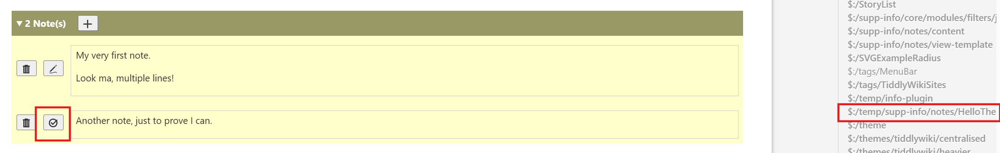

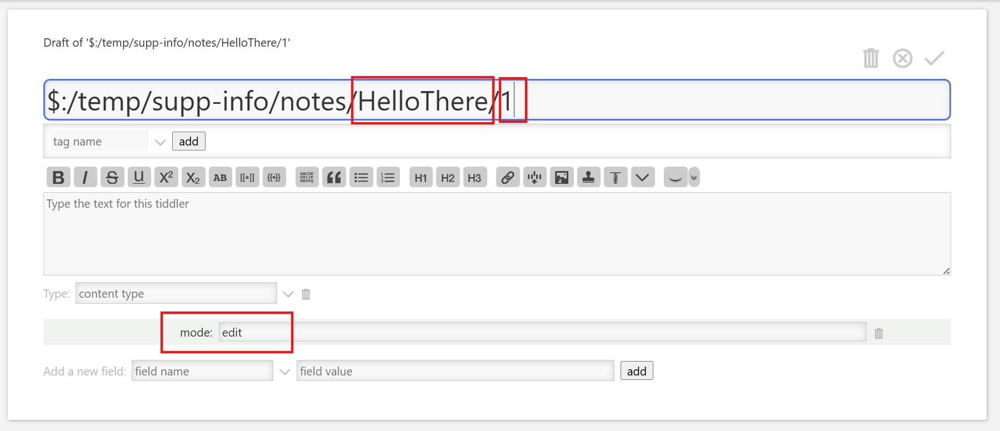

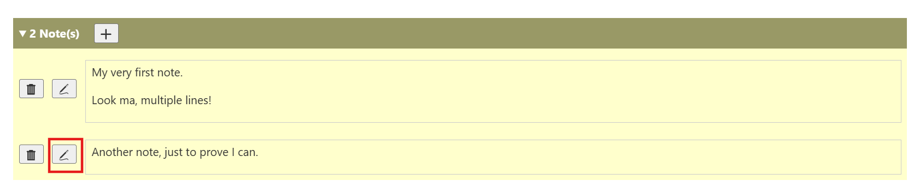

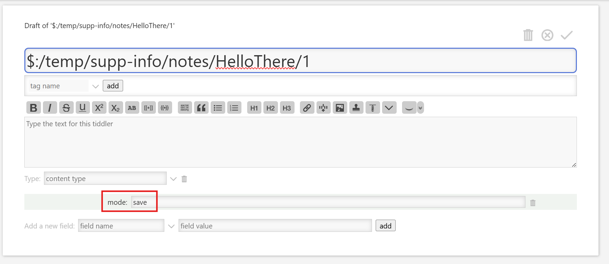

### Commits ###

|                                                                         |                                                        |
|:------------------------------------------------------------------------|:-------------------------------------------------------|
| [6fc19b9](https://github.com/CrossEye/TW5-SuppNotesDemo/commit/6fc19b9) | Toggle between edit and save buttons                   |

> ([full diff](https://github.com/CrossEye/TW5-SuppNotesDemo/compare/445a0ea..6fc19b9))


Explanation
-----------

"Dummy text" isn't going to carry use far.  We need to be able to edit our
notes.  The first step toward this is to make our button toggle between `edit`
and `save` modes.

To do this, we store some temporary state.  We create a tiddler in the
`$:/temp/supp-info/notes` namespace to hold our state, and give it the field
`mode`, which will hold either `edit` or `save`.

### View template - buttons ###

#### Code ####

```
\procedure edit-note(index)
  <$action-setfield 
    $tiddler=`$:/temp/supp-info/notes/$(currentTiddler)$/$(index)$`
    $field=mode
    $value=save
  />
\end edit-note

\procedure save-note(index)
  <$action-setfield 
    $tiddler=`$:/temp/supp-info/notes/$(currentTiddler)$/$(index)$`
    $field=mode
    $value=edit
  />
\end save-note
```

#### Analysis ####

We start with two new procedures, `edit-note` and `save-note`, which toggle the
`mode` field on our temporary tiddler between "save" and "edit"

For now, that's all they do.  We will add to them in later steps.


### View template - tiddler body

#### Code ####

```html
      <div class="note-row">
        <$let toggle=`$:/temp/supp-info/notes/$(currentTiddler)$/$(index)$` mode={{{ [<toggle>get[mode]] }}} >
          <$button actions=`<<delete-note $(index)$>>` ><span class="icon">{{$:/core/images/delete-button}}</span></$button>
          <% if [<mode>match[edit]] %>
            <$button actions=`<<edit-note $(index)$>>` ><span class="icon">{{$:/core/images/save-button}}</span></$button>
          <% else %>
            <$button actions=`<<save-note $(index)$>>` ><span class="icon">{{$:/core/images/edit-button}}</span></$button>
          <% endif %>
          <div class="note">
            <$wikify name="note" text={{{ [{$:/supp-info/notes/content}jsonget<currentTiddler>,<index>] }}} output="html">
              <<note>>
            </$wikify>
          </div>
        </$let>
      </div>
```

#### Analysis ####

We retrieve the `mode` field from our temporary tiddler and store it in the
`mode` variable.  There may be a more clever way to do this in one filter than
our version here:

```
        <$let
          toggle=`$:/temp/supp-info/notes/$(currentTiddler)$/$(index)$` 
          mode={{{ [<toggle>get[mode]] }}} 
        >
```

but this works and we won't spend any time trying to replace it.

Our `delete` button doesn't need to change, nor does the `note` itself, but we
now replace the `edit` button with an `<% if %>...<% endif %>` block that uses
this `mode` variable to decide which button to show, and which procedure to
invoke when the button is clicked.


Step 7 - Make edit and save work
================================

Changes
-------

### Download ###

We can download this and drag the resulting file to our test wiki:

> [SuppNotes_Step7.json][st7]

We can simply accept the overlaying of the earlier code.  ***But if we are
starting from a fresh copy of TiddlyWiki**, we will need to save and reload
our sample wiki to see everything function as expected.*


### Screenshots ###

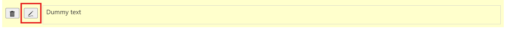

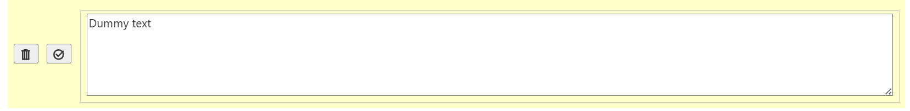

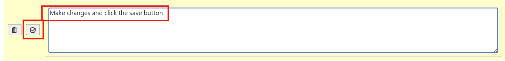

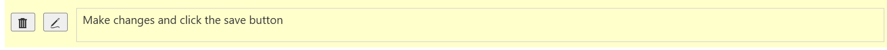


### Commits ###

|                                                                         |                                                        |
|:------------------------------------------------------------------------|:-------------------------------------------------------|
| [e3b6003](https://github.com/CrossEye/TW5-SuppNotesDemo/commit/e3b6003) | Make save button work, add sidebar                     |
| [8443a3b](https://github.com/CrossEye/TW5-SuppNotesDemo/commit/8443a3b) | Separate stylesheet                                    |
| [ebf6207](https://github.com/CrossEye/TW5-SuppNotesDemo/commit/ebf6207) | Re-caption sidebar tab                                 |
| [d1d20d7](https://github.com/CrossEye/TW5-SuppNotesDemo/commit/d1d20d7) | Make edit/save work front to back

> ([full diff](https://github.com/CrossEye/TW5-SuppNotesDemo/compare/6fc19b9..d1d20d7))


Explanation
-----------

### Sidebar Tab ###

While we're going to focus on editing and saving our note, we first introduce a
minor debugging helper.  As we shift around from our ViewTemplate to the
`HelloThere` and other tiddlers to our temporary files, we will find that
there's a lot of scrolling or searching.  It's useful to have readily available
links for these.  We do this by introducing a sidebar tab that simply collects
links to various useful tiddlers.  Then we mostly keep this tab selected.  When
the coding is done, we will remove this tab.  (If we think we are going to come
back to this, we might simply remove it from the sidebar instead.)

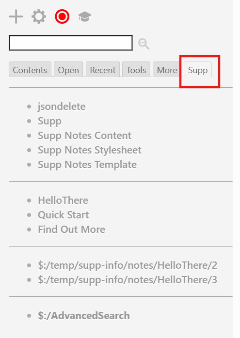

#### Code ####

```
title: $:/supp-info/core/sidebar/supp-info
tags: $:/tags/SideBar
caption: Supp

----------
<<list-links "[prefix[$:/supp-info]]">>

----------
<<list-links "HelloThere [[Quick Start]] [[Find Out More]]">>

----------
<<list-links "[prefix[$:/temp/supp-info]]">>

----------
<<list-links "$:/AdvancedSearch" >>
```


#### Analysis ####

We simply have a few lists of links, separateed by horizontal rules.

  * The code we're using to implement our features, distinguished by a prefix
  * Two select tiddlers from tiddlywiki.com for which have some associated
    Notes, and one that doesn't
  * A list of the current temporarty tiddlers in our namespace
  * The `$:/AdvancedSearch` tiddler, which is useful as we work out our code to
    test various filters.  (Yes, this is available next to the search box, but
    it really is convenient to have it here when we're scanning for the next
    tiddler we want to open.)

Since this is throw-away code, we don't want to spend too much effort on it, but
the `<<list-links>>` macro is extremely simple.

We also give `caption` fields to the custom tiddlers included in the sidebar to make them easier to distinguish.


### Separate CSS ###

 There are Tiddlywikians who prefer to work as much as possible in single files,
 distributing procedures, markup, styling, and everything else in one place.
 Here we go a different route.  While we often start in a single file for
 convenience, we separate our different content into separate tiddlers.

 The styles are an easy first step: we create the file
 `$:/supp-info/notes/styles/main`, and move the content of our `<style>` element
 into this file

 #### Code ####

```css
.supp-notes {
  div.debug {background: red; color: white; font-weight: bold; 
             font-size: 150%;}
  background-color: #ffc;
  margin-top: 3em;
  padding: 0;
  .controls {
    display: inline-block;
    margin-left: 1em;
    svg {width: 1em; height: 1em; vertical-align: middle;}
  }
  summary {background-color: #996; color: white; padding: .5em; 
           font-weight: bold;}
  .note-row {
    display: flex; 
    flex-direction: row; 
    gap: .75em;
    align-items: center;
    padding: .5em;
    &button {
      flex: 0 1 auto;
      width: 2em;
      svg {width: 1.5em; height: 1em; vertical-align: middle;}
    }
    textarea {width: 100%;}
    div.note {flex: 1 0 auto;}
  }
  .note {
    border: 1px solid #ccc; padding: .25em .5em; margin-top: .5em; 
    &>:first-child {margin-top: 0;}
  }
}
```

#### Analysis ####

There is an additional reason besides cleanliness and organization for this
move.  When we use a style element in our tiddler and open the tiddler, the
rules it generates are added to the global set of CSS rules.  This is very
useful if our styles are dynamically generated: they will be in effect only when
the containing tiddler is rendered.  But our rules will be static.

This happens for every tiddler we have open.  At the moment, we are focused on
only a few tiddlers, but eventually, we want our mechanism to apply to *all*
tiddlers (or all non-system ones.)  That means we are adding the same CSS rules
to some internal browser store over and over.  Nothing will change in rendering
because the rules are simply repeated, but its a clear waste of memory.
Although no one has mentioned significant issues because of this, it seems silly
to take such a risk, when it offers no benefit.

With this change, our main view template tiddler is simpler.  At the end, we
might choose to separate out the procedures into their own tiddler as well, but
they won't ever be used elsewhere, and its unclear if the same rationale as
above about wasted memory also applies.


### Updated procedures ###

We now handle editing and saving our note.  

#### Code ####

```
\procedure edit-note(index)
  <$action-setfield $tiddler=`$:/temp/supp-info/notes/$(currentTiddler)$/$(index)$` $field="mode" $value="save" />
  <$let 
    temp=`$:/temp/supp-info/notes/$(currentTiddler)$/$(index)$` 
    text={{{ [<temp>get[text]] }}} 
    json={{{ [{$:/supp-info/notes/content}jsonset<currentTiddler>,<index>,<text>format:json[2]] }}}
  >
    <$action-setfield $tiddler="$:/supp-info/notes/content" $field="text" $value=<<json>> />
  </$let>
\end edit-note

\procedure save-note(index)
  <$action-setfield $tiddler=`$:/temp/supp-info/notes/$(currentTiddler)$/$(index)$` $field="mode" $value="edit" />
  <$action-setfield 
    $tiddler=`$:/temp/supp-info/notes/$(currentTiddler)$/$(index)$`
    $field="text"
    $value={{{ [{$:/supp-info/notes/content}jsonget<currentTiddler>,<index>] }}} 
  />
\end save-note
```

#### Analysis ####

Many edit fields in Tiddlywiki alter their data in real-time.  When a user
checks a [CheckboxWidget][cw], the related data is, by default, immediately
updated in the tiddler store.  There are plenty of exceptions to this, including
the main tiddler editing mechanism, where a second `draft.of` tiddler is
created, and the edits are made against that.  When the this is saved, it
replaces the entire tiddler with what's in the draft.  But there is also an exit
mechanism to discard the draft and return to the original tiddler.  This can be
thought of a safety feature, so that accidental bad edits are reversible.

We'd like to emulate that safety feature here.  We do this by using our
temporary tiddler to store the current edited verson.  When we click `edit`, we
copy the code from our JSON data store into the temporary field.  When we then
click `save` we update the JSON data using the text in that tiddler.  We might
recall that we're already using the `mode` field of this tiddler.  Here we'll
use the `text` field.

<del>~~Later on, we'll come back and add a companion `exit` button to quit
without saving.~~</del> <ins>**Note from the future**: we never actually get
around to this; it ends up a TODO-item, or an excercise for the reader.</ins>

To better note what's happening, it's instructive to do a little test.  We can
create a new Note on, say, the `HelloThere` tiddler.  We should see a new temp
tiddler in the sidebar, something like `$:/temp/supp-info/notes/HelloThere/3`
(We should note that the `3` at the end may vary depending upon how many Notes
we currently have; we should also recall that the 0-based indexing in JSON means
that `3` represents the *fourth* entry.)  If we open that tiddler in edit mode,
replace the text "Dummy text" with something else, and save, we will see the
Note in `HelloThere` has also been edited.  In edit mode on our note, we are
directly editing the temporary tiddler.  Only when we hit `save` do we update
the JSON.  This is important, becase updating JSON is a relatively expensive
operation.  We don't want to be doing this on every keystroke.


Step 8 - Make notes open in edit mode when added
================================================

Changes
-------

### Download ###

We can download this and drag the resulting file to our test wiki:

> [SuppNotes_Step8.json][st8]

We can simply accept the overlaying of the earlier code.  ***But if we are
starting from a fresh copy of TiddlyWiki**, we will need to save and reload
our sample wiki to see everything function as expected.*


### Screenshots ###


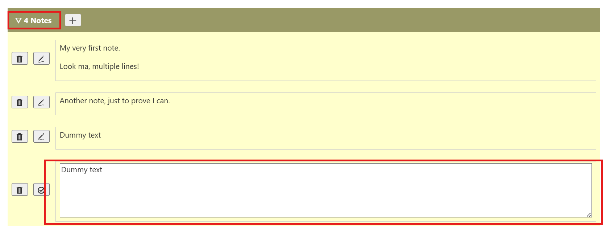


### Commits ###

|                                                                         |                                                        |
|:------------------------------------------------------------------------|:-------------------------------------------------------|
| [a876193](https://github.com/CrossEye/TW5-SuppNotesDemo/commit/a876193) | Replace details/summary with reveal widget             |
| [70161e4](https://github.com/CrossEye/TW5-SuppNotesDemo/commit/70161e4) | Ensure notes open on add action                        |     

> ([full diff](https://github.com/CrossEye/TW5-SuppNotesDemo/compare/d1d20d7..70161e4))


Explanation
-----------

We want newly created notes to open in edit mode.  It only makes sense.  When
we're creating a note, it's surely in order to add  or modify its content.  We
don't need to see it as a blank note or with our (temporary, really!) "Dummy
text" content.  So we want it opened for edit.

But there's a bit of a problem.  We are displaying the notes in a `<details>`
widget.  If that's closed, we would want to open it to display our new Note.
However, TiddlyWiki doesn't give us a very useful way to open a closed
`<details>` widget.  There are techniques for this, but they are often obscure
or convoluted.  It might well be simpler to replace the `<details>` widget with
a `<$reveal>` one.  We discussed this possibility back in step 2, and now it's
time to go ahead.

### View Template ###

This only involves minor changes to the rendering part of our view template:

#### Code ####

```
<div class="summary">
  <$button class="tc-btn-invisible toggle" set=`$:/temp/supp-info/notes/$(currentTiddler)$!!state` setTo={{{ [<currentTiddler>addprefix[$:/temp/supp-info/notes/]get[state]toggle[show],[]] }}}>
     <$let arrow={{{ [<currentTiddler>addprefix[$:/temp/supp-info/notes/]get[state]match[show]then[▽]else[▷]] }}}><<arrow>></$let>
     <<count>> Note<% if [<count>!match[1]] %>s<% endif %>
  </$button>
  <span class="controls">
    <$button actions="<<add-note>>" ><span class="icon">{{$:/core/images/new-button}}</span></$button>
  </span>
</div>
<$reveal state=`$:/temp/supp-info/notes/$(currentTiddler)$!!state` type="match" text="show" tag=div>
  <div class="note-list"> <!-- ... --></div>
</$reveal>
```

#### Analysis ####

Although we've removed the `<details>` element and its child `<summary>` one, we use the class "summary" on the `<div>` showing the top bar; it's a logical name to use in our CSS, and in fact in our stylesheet, we chiefly switch from using the element selector `summary` to the class selector `.summary`.

We add a button for the arrow and hook it into a `state` field on a new temp tiddler named for the current tiddler.  This is different from our other temp tiddlers, which were named for the current tiddler *plus the index* in the JSON; it's one level higher.  On press, we toggle our button between "show" and a blank value.  And we toggle the arrow to display between "▽" and "▷" based upon that `state` field.  Our controls don't change.  But the hidden and shown part are now wrapped in a `<$reveal>` widget, based on that field.

----------

But we also need to update our add-note action, to ensure both that our additional note is in edit mode, and that the list of notes is clearly visible.

#### Code ####

```
\procedure add-note()
  <!-- unchanged -->
  <$action-setfield $tiddler=`$:/temp/supp-info/notes/$(currentTiddler)$` $field="state" $value="show" />
  <$action-setfield $tiddler=`$:/temp/supp-info/notes/$(currentTiddler)$/$(count)$` $field="mode" $value="edit" />
\end add-note
```

#### Analysis ####

We set two fields, the `state` field we just discussed above in the tiddler's temp partner, setting it to `show`, and the `mode` field in the temp tiddler for the specific note, setting it to `edit`.

**Note** that there are [additional changes][ac] in this section that were intenced to set the focus on the the newly added note.  We can at some point come back to try to fix this, as it would be useful to have.  Or someone who understands TiddlyWiki's focus mechanism might chime in and explain what's wrong with this code.


Step 9 - Handle all tiddlers, not just preconfigured ones
=========================================================

Changes
-------

### Download ###

We can download this and drag the resulting file to our test wiki:

[SuppNotes_Step9.json][st9]

We can simply accept the overlaying of the earlier code.  ***But if we are
starting from a fresh copy of TiddlyWiki**, we will need to save and reload
our sample wiki to see everything function as expected.*


### Screenshots ###

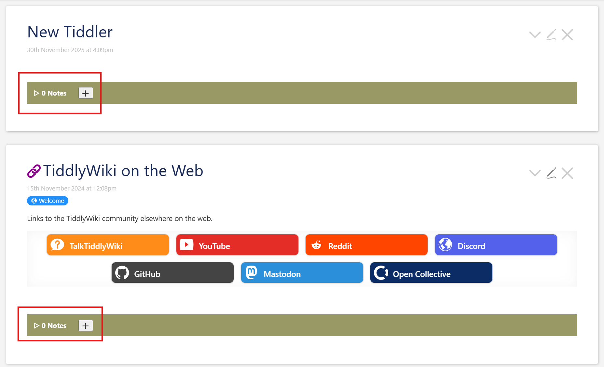

### Commits ###

|                                                                         |                                                        |
|:------------------------------------------------------------------------|:-------------------------------------------------------|
| [d923432](https://github.com/CrossEye/TW5-SuppNotesDemo/commit/d923432) | Add notes to all plain tiddlers, not just predefined   |
|                                                                         |      
> ([full diff](https://github.com/CrossEye/TW5-SuppNotesDemo/compare/70161e4..d923432))


Explanation
-----------

### View Template ###

We've been working on just a few tiddlers, and we have not been able to add
notes to any that are not already in our JSON store.  Obviously we need to fix
that.

Fixing the template is nearly trivial, just a change to the `<%if>` surrounding
most of the tamplate:

```diff
- <% if [{$:/supp-info/notes/content}jsonget<currentTiddler>] %>
+ <% if [<currentTiddler>is[tiddler]!is[system]] %>
```

Unfortunately, this is not enough.  We need to add an empty array to our JSON
before we attempt to add a note to it, so we update the `add-note` procedure to
begin with this:

```
    <% if [{$:/supp-info/notes/content}jsonindexes<currentTiddler>count[]match[0]] %>
      <$action-log message="AAA" count=<<count>> css-index=<<css-index>> />
      <$action-setfield 
        $tiddler="$:/supp-info/notes/content"
        $value={{{ [{$:/supp-info/notes/content}jsonset:array<currentTiddler>format:json[2]] }}}    
    <% else %>
    <% endif %>
```

We'll notice the addition of an [`action-log` widget][al]  here.  While this was
left in unintentionally, it might still be instructive.  If we open the
developer's console (often `CTRL/CMD-SHIFT-J`) and create a new tiddler then
click the add-note button, we should see something like this in the console:

```json
{"count": "", "css-index": "1", "message": "AAA"}
```

(often with some nice tabular formatting).  The fields we included in the log
widget show up here.  We used `message` to distinguish this from any other
places we're logging.  And we wanted to know what `count` and `css-index`
variables held.  That latter was part of the attempt to control focus from the
previous step, and not really relevant anymore, nor was some additional code in
the template around the same idea, which we ignore  The empty `<% else %>` block
is almost certainly leftover from the same debugging step.  At one point it
probably had another `action-log` widget with a different message.  These can help us get our bearings about what it happening without the need to fire up a debugger.

But our main activity here is the `<$action-setfield>` call which gets our JSON
string and adds a new array node for our current tiddler, using [`jsonset`][js] and its `array` suffix, to convert the string to an object and create an array at our `currentTiddler` location.  And then we reformat the resulting JSON string for easier readability.

We don't try to distinguish between the case of when the node exists and has an empty array, and when the node doesn't exist.  We simply create/recreate it with an empty array.

Then we update the code to set the edit mode for our newly created note:

```diff
-    <$action-setfield $tiddler=`$:/temp/supp-info/notes/$(currentTiddler)$/$(count)$` $field="mode" $value="edit" />
+     <$let key={{{ [<count>else[0]add[1]subtract[1]] }}}> <!-- TODO: fix this ridiculous hack! -->
+       <$action-setfield $tiddler=`$:/temp/supp-info/notes/$(currentTiddler)$/$(key)$` $field="mode" $value="edit" />
+     </$let>
```

There is an absurd hack in here, and it would be wonderful if someone could explain why `[<count>else[0]]` fails, but `[<count]else[0]add[1]subtract[1]` works, and could demonstrate a less ridiculous looking version.

In any case we use that hack to ensure that `key` is the number we were expecting `count` to be, and use it to set our `mode` to `edit`.


Step 10 - Handle tiddler renaming
=================================

Changes
-------

### Download ###

We can download this and drag the resulting file to our test wiki:

> [SuppNotes_Step10.json][st10]

We can simply accept the overlaying of the earlier code.   ***But there is a new
tiddler included**, and that one is a JS module, so we will need to save and
reload our sample wiki to see these changes.*


### Screenshots ###

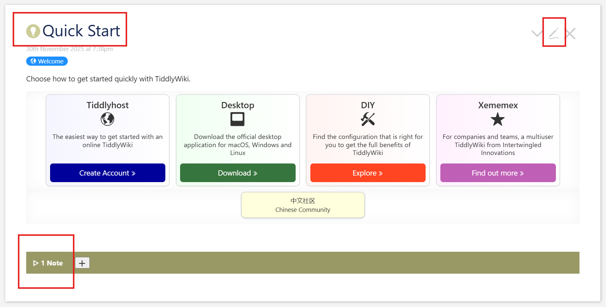

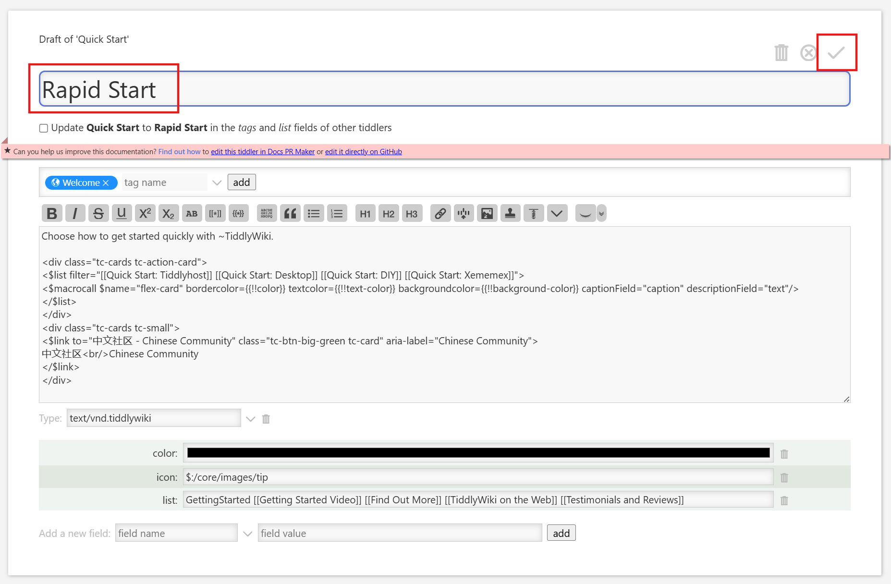

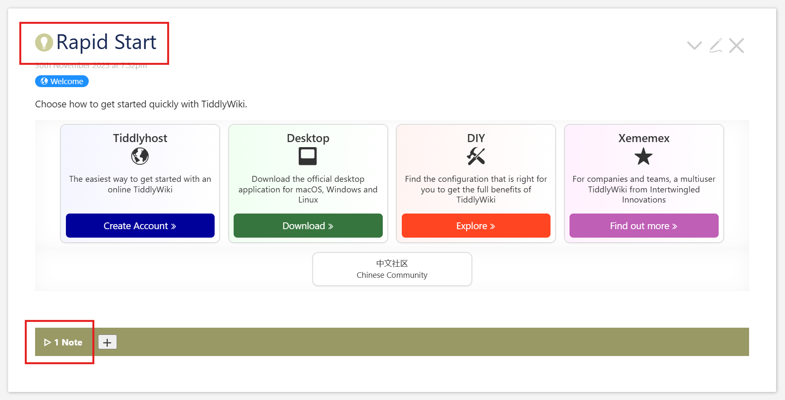

### Commits ###

|                                                                         |                                                        |
|:------------------------------------------------------------------------|:-------------------------------------------------------|
| [72eacb1](https://github.com/CrossEye/TW5-SuppNotesDemo/commit/72eacb1) | Add rename handler                                     |

> ([full diff](https://github.com/CrossEye/TW5-SuppNotesDemo/compare/d923432..72eacb1))


Explanation
-----------

### Rename module ###

There is an outstanding problem without an obvious solution.  Our notes are
indexed by their *titles*.  That's fine, as titles are unique across a wiki.
But we are allowed to *rename* them.  What happens then?  As of now, they are
simply orphaned.  If we change "Quick Start" to "Rapid Start", our tiddler will
lose connection to the note(s) we've created for it.  And if later, if we create
a new tiddler with the title "Quick Start", it will inherit the notes we meant
for the older one.

There is no obvious wikitext solution to this.  And the somewhat obvious
JavaScript solutions [also didn't work][rt].  But that discussion lead to one
JavaScript alternative.  It involves a JS module
(`$:/supp-info/notes/modules/startup/rename`) with `module-type` of `startup`,
and it uses the [hooks mechanism][hm] to connect everything together:


#### Code ####

```js
/*\
title: $:/supp-info/notes/modules/startup/rename
type: application/javascript
module-type: startup

Add hook for renames to update 'Renamed' text field
\*/

"use strict";

// Export name and synchronous status
exports.name = "rename";
exports.platforms = ["browser"];
exports.after = ["startup"];
exports.synchronous = true;

const replaceKey = (oldKey, newKey) => (obj) =>
  Object.fromEntries(Object.entries(obj).map(
    ([k, v]) => [k == oldKey ? newKey : k, v]
  ))

exports.startup = function() {

  $tw.hooks.addHook("th-saving-tiddler", function (newTiddler, oldTiddler) {
    if (
      newTiddler?.fields?.title === oldTiddler?.fields?.['draft.title'] 
      && newTiddler?.fields?.created === oldTiddler?.fields?.created
      && newTiddler?.fields?.title !== oldTiddler?.fields?.['draft.of']
    ) {
      // We're in a rename scenario
      $tw.wiki.setText(
        '$:/supp-info/notes/content', 
        'text', 
        null, 
        JSON.stringify(
          replaceKey(oldTiddler.fields["draft.of"] || oldTiddler.fields.title, newTiddler.fields.title)(
            JSON.parse($tw.wiki.getTiddler('$:/supp-info/notes/content').fields.text)
          ), 
          null, 
          4
        )
      )
    } 
    return newTiddler;
  });
};
```

#### Analysis ####

The first fifteen lines are essential boilerplate for TiddlyWiki's JavaScript
modules.  The leading comment establishes the type of module ("startup") as well
as the `title` and the `mime type`; it also has an actual comment to describe
the module.  After the [`use strict`][us] incantation, we have the `exports.*`
block that describes the public interface of the function.

After that is the JavaScript helper function `replaceKey`, which accepts the
name of a key in an object, and the name of a replacement key, and returns a
function which accepts an object and returns a new object, equivalent to the
input except that the key has been replaced.  It does this by

  * splitting the object into an array of two-entry arrays representing
    key-value pairs (`Object.entries`)
  * Using `.map` to convert those pairs with a function that tests whether the
    key matches our old key, and
    * if it does, returning one with the new key instead, and the same value
    * if it doesn't, returning the pair intact
  * recombining these new key-value pairs back into an object
    (`Object.fromEntries`)

Again changing the `exports` object, we create a function to run on startup, and
in that we associate a new function with the [`tm-saving-tiddler` hook][st].
This means our function will run whenever that hook is invoked, which includes
when the user edits a tiddler and saves.  It passes both the old tiddler and the
new tiddler with all its changes.

We now check to see if the new tiddler title is different from the old one with
a conditional that looks like this:

```js
    if (
      newTiddler?.fields?.title === oldTiddler?.fields?.['draft.title'] 
      && newTiddler?.fields?.created === oldTiddler?.fields?.created
      && newTiddler?.fields?.title !== oldTiddler?.fields?.['draft.of']
    )
```

If the `?.` and `?.['some-name']` syntax is unfamiliar, it's simply a way to
keep chaining property access even when one stage is `null` or `undefined`,
returning `undefined` at the end in that case.  You can read more in MDN's
[Optional Chaining][oc] article.

We check if the new tiddler's `title` field is equal to the old tiddler's
`draft.title`, if they have the same `created` fields, and if the new tiddler's
`title` is different than the old one's `draft.of`.  If all these are true, then
we're in a renaming scenario.  Here we

  1. extract the JSON contents from its tiddler
  2. use `JSON.parse` to turn that into an object
  3. use the `replaceKey` function above using 
     * the old tiddler's `draft.of` or `title` field
     * the new tiddlers `title` field
     * that parsed object
  5. call `JSON.stringify` on the result
  6. set the text of the JSON contents tiddler with this new string.
  7. return the new tiddler intact.  (Our actions here were all side-effects.)

##### Recap #####

That's a lot of explanation for a relatively simple module.  In summary, we
listen for save events, and, if they look to be renames, we update our JSON
store with the new name for the same contents.

##### Missing #####

There is one activity missing here; this we will leave as an exercise for the
reader.  We haven't renamed our temp tiddlers which describe the state of the
Notes section for the current tiddler.  The whole section will default to
closed, the mode for the specific note will be `edit`, meaning the `edit` button
is displayed, and if there was a text edit underway on the note, it will be
lost.  This should be relatively easy to fix. (<small><ins>TODO</ins></small>)


### View Template ###

We make two minor edits to the View Template:

  * We remove the `<action-log>` debugging message described in Step 9.
  * We replace the "Dummy text" filler with a blank message.  That was useful
    filler as we developed, but has become a distraction.  Now when we create a
    new Note, it will be blank.


Step 11 - Use palette colors
============================

Changes
-------

### Download ###

We can download this and drag the resulting file to our test wiki:

> [SuppNotes_Step11.json][st11]

We can simply accept the overlaying of the earlier code.   ***But if we are
starting from a fresh copy of TiddlyWiki**, we will need to save and reload
our sample wiki to see everything function as expected.*


### Screenshots ###

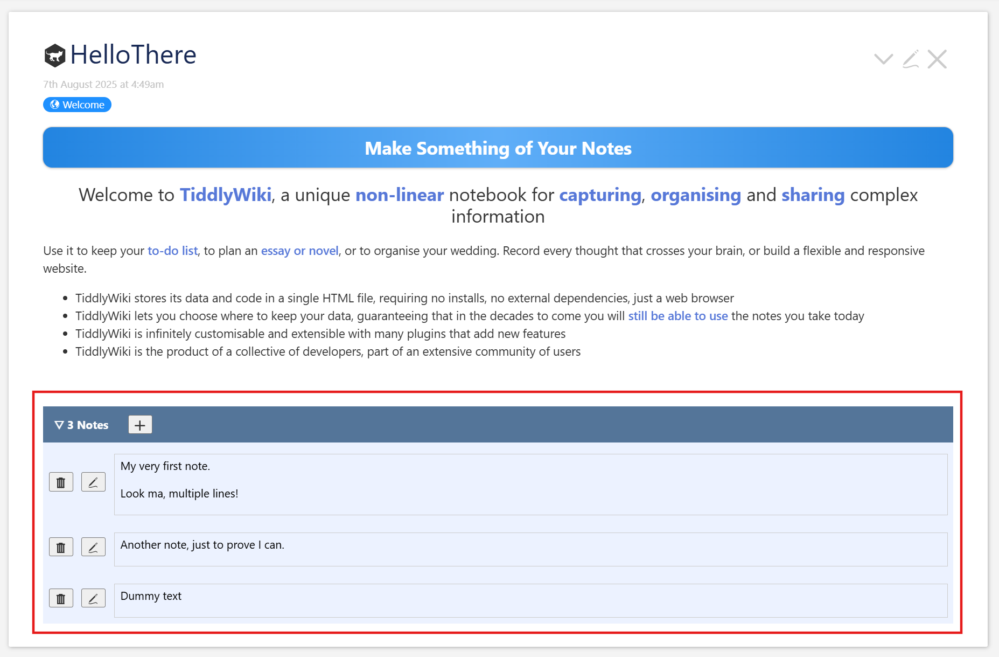

### Commits ###

|                                                                         |                                                        |
|:------------------------------------------------------------------------|:-------------------------------------------------------|
| [a6a98dd](https://github.com/CrossEye/TW5-SuppNotesDemo/commit/a6a98dd) | Change styles to use palette                           |
| [e288d0a](https://github.com/CrossEye/TW5-SuppNotesDemo/commit/e288d0a) |
Fix palette contrast issue                             |

> ([full diff](https://github.com/CrossEye/TW5-SuppNotesDemo/compare/72eacb1..e288d0a))


Explanation
-----------

### Stylesheet ###

We promised early on to introduce a less jarring color scheme for our Notes.  We
do so here.

First off, we need to change from `type: text/css` to `type:
text/vnd.tiddlywiki` (which is the default value, so we can just remove the
`type` content instead.)  This is because our stylesheet will now be dynamic,
using calls to the `<<colour>>` macro.  `text/css` is only for static sheets.

Then we simply need to use some palette entries for our key colors:

#### Code ####

Here we focus only on the changes made to use the current palette:

```css
.supp-notes {
  background-color: <<color message-background>>;
  color: <<color message-foreground>>;
  .summary, .summary button.toggle {
    background-color: <<color message-foreground>>; 
    color: <<color message-background>>; 
  }
}
```

#### Analysis ####

We choose the `message-background` and `message-foreground` for their fit with the main content, for their relatively subtle difference from the main tiddler background, and for their clear contrast from one another.

**Note** There was a bug in this that was left in the initial build of the system.  As our author was writing up his notes, he realized there was a simple fix and applied it.  If we see notes about problems in some palettes, it's due to this.


Still to do
===========

TODO: write this section!  :smile:


  [ac]: https://github.com/CrossEye/TW5-SuppNotesDemo/compare/d1d20d7..70161e4#diff-1fa4c91a6b7aa3b0ddab5131f1d46ba02c48b339df37a024feefbcddae8026aaL9-R20
  [al]: https://tiddlywiki.com/#ActionLogWidget
  [bw]: https://tiddlywiki.com/#ButtonWidget
  [chg3]: https://github.com/CrossEye/TW5-SuppNotesDemo/compare/e736df9..6ada50e#diff-1fa4c91a6b7aa3b0ddab5131f1d46ba02c48b339df37a024feefbcddae8026aaL20-L25
  [cs]: https://duckduckgo.com/?q=css+tutorial
  [cn]: https://developer.mozilla.org/en-US/docs/Web/CSS/Guides/Nesting/Using
  [cnu]: https://caniuse.com/css-nesting
  [ct]: https://css-tricks.com/
  [cw]: https://tiddlywiki.com/#CheckboxWidget
  [ds]: https://developer.mozilla.org/en-US/docs/Web/HTML/Reference/Elements/details
  [dt]: https://talk.tiddlywiki.org/t/14422
  [dtd]: https://talk.tiddlywiki.org/t/14429
  [eu]: https://talk.tiddlywiki.org/t/14468
  [f2]: https://github.com/CrossEye/TW5-SuppNotesDemo/commit/70161e4#diff-cee44b2fba400d4d2bd6e8445f79395f067abf8ead628e391cf034cdd1968a76
  [f4]: https://github.com/CrossEye/TW5-SuppNotesDemo/commit/70161e4#diff-1fa4c91a6b7aa3b0ddab5131f1d46ba02c48b339df37a024feefbcddae8026aa
  [gw]: https://talk.tiddlywiki.org/t/14301/6
  [hm]: https://tiddlywiki.com/dev/#HookMechanism:%5Bprefix%5BHook:%5D%5D
  [jd]: https://github.com/TiddlyWiki/TiddlyWiki5/pull/9390
  [jds]: https://github.com/TiddlyWiki/TiddlyWiki5/issues/9371#issuecomment-3513056084
  [jg]: https://tiddlywiki.com/#jsonget%20Operator
  [ji]: https://tiddlywiki.com/#jsonindex%20Operator
  [js]: https://tiddlywiki.com/#jsonset%20Operator
  [lw]: https://tiddlywiki.com/#ListWidget
  [mc]: https://developer.mozilla.org/en-US/docs/Web/CSS
  [oc]: https://developer.mozilla.org/en-US/docs/Web/JavaScript/Reference/Operators/Optional_chaining
  [pr]: https://tiddlywiki.com/#Procedures
  [rt]: https://talk.tiddlywiki.org/t/14432
  [rw]:https://tiddlywiki.com/#RevealWidget
  [sav]: https://tiddlywiki.com/#Substituted%20Attribute%20Values
  [st]: https://tiddlywiki.com/dev/#Hook%3A%20th-saving-tiddler
  [st1]: https://raw.githubusercontent.com/CrossEye/TW5-SuppNotesDemo/refs/heads/main/post/SuppNotes_Step1.json
  [st2]: https://raw.githubusercontent.com/CrossEye/TW5-SuppNotesDemo/refs/heads/main/post/SuppNotes_Step2.json
  [st3]: https://raw.githubusercontent.com/CrossEye/TW5-SuppNotesDemo/refs/heads/main/post/SuppNotes_Step3.json
  [st4]: https://raw.githubusercontent.com/CrossEye/TW5-SuppNotesDemo/refs/heads/main/post/SuppNotes_Step4.json
  [st5]: https://raw.githubusercontent.com/CrossEye/TW5-SuppNotesDemo/refs/heads/main/post/SuppNotes_Step5.json
  [st6]: https://raw.githubusercontent.com/CrossEye/TW5-SuppNotesDemo/refs/heads/main/post/SuppNotes_Step6.json
  [st7]: https://raw.githubusercontent.com/CrossEye/TW5-SuppNotesDemo/refs/heads/main/post/SuppNotes_Step7.json
  [st8]: https://raw.githubusercontent.com/CrossEye/TW5-SuppNotesDemo/refs/heads/main/post/SuppNotes_Step8.json
  [st9]: https://raw.githubusercontent.com/CrossEye/TW5-SuppNotesDemo/refs/heads/main/post/SuppNotes_Step9.json
  [st10]: https://raw.githubusercontent.com/CrossEye/TW5-SuppNotesDemo/refs/heads/main/post/SuppNotes_Step10.json
  [st11]: https://raw.githubusercontent.com/CrossEye/TW5-SuppNotesDemo/refs/heads/main/post/SuppNotes_Step11.json
  [su]: https://developer.mozilla.org/en-US/docs/Web/HTML/Reference/Elements/summary
  [tw]: https://tiddlywiki.com
  [us]: https://developer.mozilla.org/en-US/docs/Web/JavaScript/Reference/Strict_mode
  [vt]: https://tiddlywiki.com/#SystemTag%3A%20%24%3A%2Ftags%2FViewTemplate
  [ww]: https://tiddlywiki.com/#WikifyWidget

